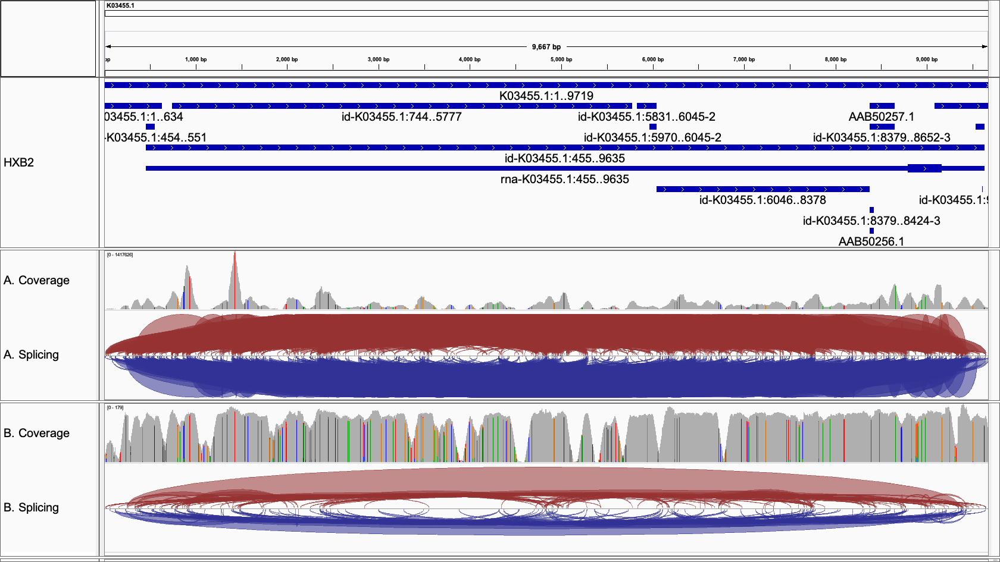
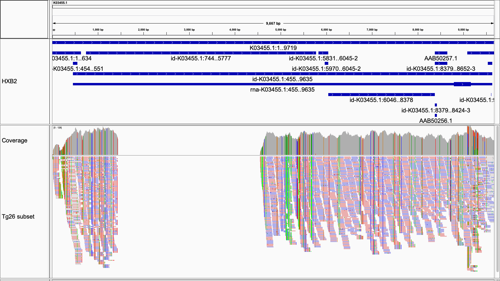

# Virus_Graphs

Making Representative Genome Graphs from Eukaryotic Viruses and Phages

HIV inference based on NGS data. 

## Ideas

* k-mer idea

HIV inference

**Figure: HIV-1 references (n = 170)** SWIGG, visualized in Gephi.

n = 39 without non-recombinants. 

env, V1-V5

pol

How much variation can we have in a reference graph genome?

Tools considered: [VG](https://github.com/vgteam/vg), [NovoGraph](https://github.com/NCBI-Hackathons/NovoGraph), [SWIGG](https://github.com/NCBI-Codeathons/SWIGG).

The color(a compact representation of the number of sub-lineages a particular K-mer appears in) information can be computed by running the Annotate_Colors.ipynb note book. The inputs are the sketch graph of the viral genomes as obtained from SWIGG and the meta data obtained from the reference genomes. 

## Outline, plan of action

Day 1:

Dataset options: T-virus, HIV-1
Method options: SWIGG, VG
Visualization: 

Day 2: 

Datasets: T-virus, HIV-1
         
Day 3:

## Datasets ##

### HIV-1 Genome assemblies ###

HIV-1 datasets (as mutli-sequence alignments (MSA)/with gaps, and as multi-FASTA/gappless) from Los Alamos National Laboratory's [HIV Sequence Database](https://www.hiv.lanl.gov/content/sequence/HIV/mainpage.html) on November 5th-6th, 2019. Files set to include HXB2 K03455 as reference.

All complete genomes (n=10568).

**Tissue type**

CD4+ T cell (n=) vs PBMC (n=1555).

**Tropism**

Only CCR5 (n= 456) vs only CXCR4 (n= 43) vs R5X4 (n=51).

**Patient Information**

Acute infection (n=525)

AIDS (n=66)

Asymptomatic (n=223)

Symptomatic (n=83)

Deceased (n=7)

Chronic (n= 174)

### HIV-1 Sequencing data ###

**Figure: cDNA+PCR DNAseq ("classic RNAseq").** A. Coverage summary of reads mapped to HXB2 K03455 with HISAT2 with usegalaxy.eu. B. RmDup-processed reads, controling for PCR duplicates after initial alignment. Search strategy = SRA. Searchterms: "HIV-1 and RNAseq and virus". Bioproject: PRJNA320293, specifically SRR3472915. Viewed in IGV.

**Figure: Unpublished HXB2 ONT dataset.** [Gener, 2019](https://www.biorxiv.org/content/10.1101/611848v1). Coverage summary of reads mapped to HXB2 K03455 with minimap2 with usegalaxy.eu. Viewed in IGV. Note, "4000 reads" denotes the FASTQ subsetting from Guppy basecaller. Note also that PCR was used during ONT library prep.

**Figure: Unpublished pNL4:3d1443 Tg26 subset.** Coverage summary of reads mapped to HXB2 K03455 with minimap2 with usegalaxy.eu. [Tg26 is an HIV-1 transgenic mouse with a deletion in gagpol](https://www.jax.org/strain/022354). PCR-free PE 150. Viewed in IGV.

